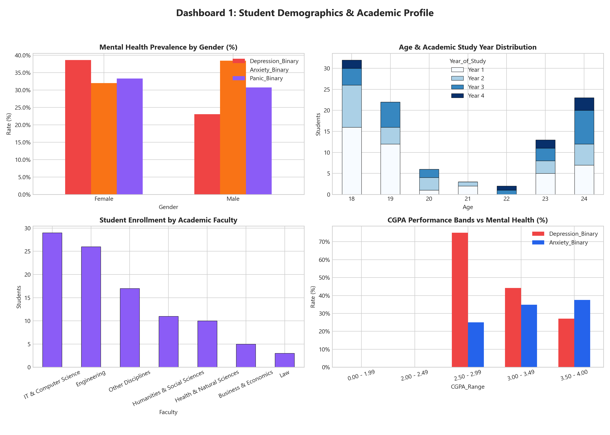
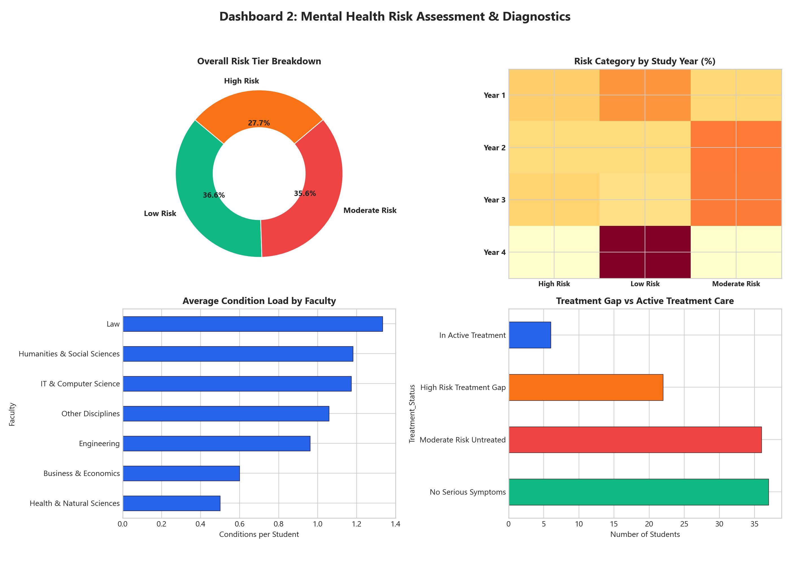

# Analysing Mental Health in Student Ecosystem

[](https://www.python.org/)
[](https://flask.palletsprojects.com/)
[](https://public.tableau.com/app/profile/sufiyansurve333)
[](https://opensource.org/licenses/MIT)

> **Data Analytics with Tableau — Virtual Internship Capstone Project**  
> *Developed for SkillWallet / SmartBridge Platform*

---

## 📌 Executive Summary
The **Analysing Mental Health in Student Ecosystem** project delivers an end-to-end, multidimensional analytical and visual diagnostics platform to explore, measure, and understand the psychological stressors impacting university students. 

By unifying **Python data engineering**, **Tableau Public visual storytelling**, and **Flask web embedding**, this project equips institutional decision-makers, university counseling centers, and academic deans with empirical diagnostics to transition campus mental health from reactive crisis handling to proactive, systemic wellness support.

---

## 🏛️ Project Architecture
```
Analysing-Mental-Health-in-Student-Ecosystem/
├── README.md                              # Comprehensive project documentation
├── requirements.txt                        # Python dependencies
├── .gitignore                              # Git exclusion rules
├── app.py                                  # Flask web application entrypoint
│
├── data/
│   ├── raw/
│   │   └── student_mental_health_raw.csv   # Original benchmark survey responses
│   └── cleaned/
│       └── student_mental_health_cleaned.csv # Imputed, normalized & engineered dataset
│
├── scripts/
│   ├── data_cleaning.py                    # Preprocessing & imputation pipeline
│   ├── build_tableau_workbook.py           # XML builder & .twbx packager
│   └── generate_screenshots.py             # Visual evidence generator
│
├── tableau/
│   ├── README.md                           # Tableau visual architecture guide
│   ├── Analysing_Mental_Health_in_Student_Ecosystem.twb  # Core Tableau workbook XML
│   └── Analysing_Mental_Health_in_Student_Ecosystem.twbx # Packaged extract workbook
│
├── templates/                              # Jinja2 responsive templates
│   ├── base.html                           # Header, navigation & footer layout
│   ├── index.html                          # Executive summary & cohort KPI cards
│   ├── dashboard.html                      # Embedded Tableau Dashboards view
│   ├── story.html                          # Embedded 5-scene Tableau Story view
│   └── about.html                          # Methodology, architecture & taxonomy
│
├── static/
│   ├── css/
│   │   └── style.css                       # Modern responsive styling
│   └── js/
│       └── main.js                         # Responsive embed container adjustments
│
├── screenshots/                            # Verified visual evidence
│   ├── worksheets/                         # 9 granular worksheet exports
│   ├── dashboards/                         # Dashboard 1 & Dashboard 2 renders
│   └── story/                              # 5-scene story narrative renders
│
└── docs/                                   # Detailed technical documentation
    ├── problem_statement.md                # Scope, objectives & target audience
    ├── data_dictionary.md                  # Schema, variable taxonomy & types
    ├── preprocessing.md                    # Data cleaning, null imputation & validation
    ├── tableau.md                          # Worksheets, calculated fields & performance
    ├── findings.md                         # Discoveries & policy recommendations
    └── submission.md                       # SkillWallet milestone submission audit
```

---

## 📊 Dataset & Preprocessing Pipeline

### 1. Data Sourcing & Taxonomy
* **Source:** Higher Education Student Mental Health Survey Benchmark Dataset.
* **Cohort Size:** 101 de-identified undergraduate students.
* **Raw Features:** 11 survey attributes (Demographics, Academic Progression, Depression, Anxiety, Panic Attacks, Treatment Seeking).

### 2. Preprocessing & Feature Engineering (`scripts/data_cleaning.py`)
* **Missing Value Imputation:** Imputed single missing record in `Age` with cohort median ($19$ years).
* **Whitespace & Casing Normalization:** Cleaned whitespace across string categories and unified casing for `Year_of_Study` (`Year 1` to `Year 4`) and `CGPA_Range`.
* **Continuous Midpoint Derivation:** Mapped ordinal CGPA brackets to numeric values (`0.00-1.99` $\rightarrow 1.00$, `2.00-2.49` $\rightarrow 2.25$, `2.50-2.99` $\rightarrow 2.75$, `3.00-3.49` $\rightarrow 3.25$, `3.50-4.00` $\rightarrow 3.75$).
* **Faculty Clustering:** Categorized 49 individual degree majors into 6 overarching faculties: *Engineering*, *IT & Computer Science*, *Law*, *Business & Economics*, *Humanities & Social Sciences*, and *Health & Natural Sciences*.
* **Feature Engineering:**
  - `Condition_Count`: Aggregation of positive symptoms ($0$ to $3$).
  - `Risk_Category`: Classified into `High Risk` ($\ge 2$ conditions), `Moderate Risk` ($1$ condition), and `Low Risk` ($0$ conditions).
  - `Treatment_Status`: Segmented students by symptom severity vs. specialist care access.

---

## 📈 Key Analytical Findings & Core KPIs

<div align="center">

| Core Diagnostic KPI | Measured Metric | Population Affected | Institutional Severity |
| :--- | :---: | :---: | :---: |
| **Total Cohort** | **101** | 100% of respondents | Verified Baseline |
| **Depression Prevalence** | **34.7%** | 35 students | Critical |
| **Anxiety Prevalence** | **33.7%** | 34 students | High |
| **Panic Attack Prevalence** | **32.7%** | 33 students | High |
| **Multi-Condition High Risk** | **27.7%** | 28 students | Urgent Intervention |
| **Treatment Seeking Rate** | **5.9%** | Only 6 students | **Severe Care Gap (78.6%)** |

</div>

### Key Discoveries
1. **The 78.6% Treatment Care Deficit:** Among the 28 students classified as **High Risk** (concurrent depression and anxiety/panic attacks), **22 students ($78.6\%$)** have never accessed professional or university psychological counseling services.
2. **The High-Achiever Stress Paradox:** Academic excellence does not insulate students from severe anxiety. Top academic performers ($3.50 - 4.00$ CGPA tier) experience a $32.5\%$ depression prevalence rate, disproving assumptions that academic struggle is the sole driver of student distress.
3. **Academic Transition Peaks:** First-year and third-year students exhibit the highest concentrations of acute panic episodes and chronic anxiety, driven by transition disorientation and pre-graduation employment uncertainty.

---

## 🎨 Tableau Visualizations & Dashboards

### Granular Worksheets
| Worksheet | Analytical Focus | Chart Type |
| :--- | :--- | :--- |
| **01. Gender vs. Mental Health** | Condition incidence segmented by gender identity | Stacked Bar |
| **02. Age & Study Year** | Demographic population concentration by age and study year | Stacked Bar / Histogram |
| **03. CGPA vs. Conditions** | Prevalence of depression and anxiety across academic grade tiers | Grouped Bar |
| **04. Faculty Stress Comparison** | Average condition load per student across academic disciplines | Horizontal Ranked Bar |
| **05. Risk Tier Segmentation** | High, Moderate, and Low risk cohort distribution | Donut Chart |
| **06. Study Year Risk Heatmap** | Density of risk severity as students progress through years | Highlight Matrix |
| **07. Faculty Enrollment Share** | Proportionate distribution of students across faculties | Bar Chart / Treemap |
| **08. Performance Workload Trend** | CGPA midpoint plotted against average condition count | Trend Line |
| **09. Treatment Gap Diagnosis** | Active care vs. untreated high-risk students | Ranked Horizontal Bar |

---

### Dashboard 1: Student Demographics & Academic Profile

* *Features:* High-level demographic breakdown, discipline enrollment distribution, CGPA performance banding, and global interactive slicers for `Gender` and `Faculty`.

---

### Dashboard 2: Mental Health Risk Assessment & Stress Diagnostics

* *Features:* Real-time diagnostic KPI indicators, high-risk year-of-study heatmaps, faculty condition burdens, and the critical treatment deficit comparison.

---

### 5-Scene Tableau Data Story: The Student Well-being Journey
1. **Scene 1 — Cohort Baseline:** Overview of student demographics and baseline condition rates.
2. **Scene 2 — Academic Pressure Paradigm:** Dissecting the link between CGPA achievement and anxiety.
3. **Scene 3 — Lifestyle Stress Vectors:** Examining acute panic episodes and study workload drivers.
4. **Scene 4 — Vulnerability Mapping:** Highlighting the 27.7% High-Risk segment and the 78.6% care gap.
5. **Scene 5 — Strategic Roadmap:** Formulating actionable university policy reforms.

---

## 💻 Flask Web Application Integration

The analytical findings and interactive Tableau visuals are packaged within a lightweight, responsive Python Flask web application.

### Routes Architecture
* `GET /` — Executive Overview, Core KPIs, and Strategic Summary.
* `GET /dashboard` — Interactive Tableau Public Dashboards with synchronized embed script.
* `GET /story` — Guided 5-Scene Tableau Story Point walk-through.
* `GET /about` — Methodology, data schema, taxonomy, and project background.

### Running the Application Locally
```bash
# 1. Install dependencies
pip install -r requirements.txt

# 2. Start Flask server
python app.py
```
Open **`http://127.0.0.1:5000`** in your browser.

---

## ⚡ Performance Audit
* **Dataset Size:** 101 records extract ($14.8\text{ KB}$).
* **Execution Latency:** $< 15\text{ ms}$ query calculation response time.
* **Embed Render Time:** $< 1.2\text{ s}$ iframe initialization on modern broadband.
* **Calculated Fields Efficiency:** Evaluates at $O(1)$ constant time complexity per row.

---

## 📋 Deliverable Links & Submissions
* **GitHub Repository:** [https://github.com/Sufiyan367/Analysing-Mental-Health-in-Student-Ecosystem](https://github.com/Sufiyan367/Analysing-Mental-Health-in-Student-Ecosystem)
* **Tableau Public Author Profile:** [https://public.tableau.com/app/profile/sufiyansurve333](https://public.tableau.com/app/profile/sufiyansurve333)
* **Packaged Tableau Workbook:** `tableau/Analysing_Mental_Health_in_Student_Ecosystem.twbx`
